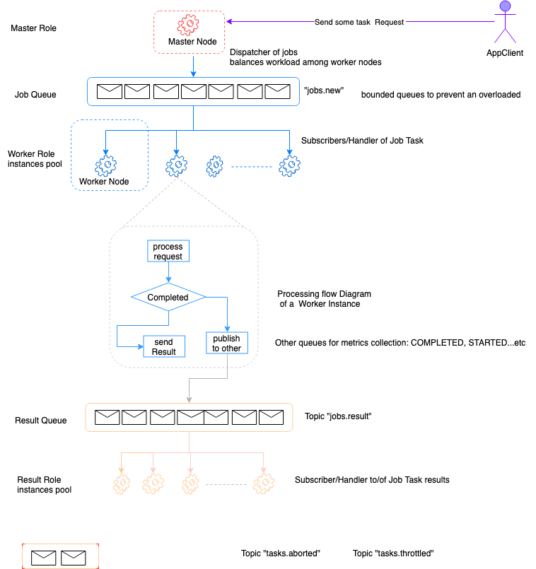
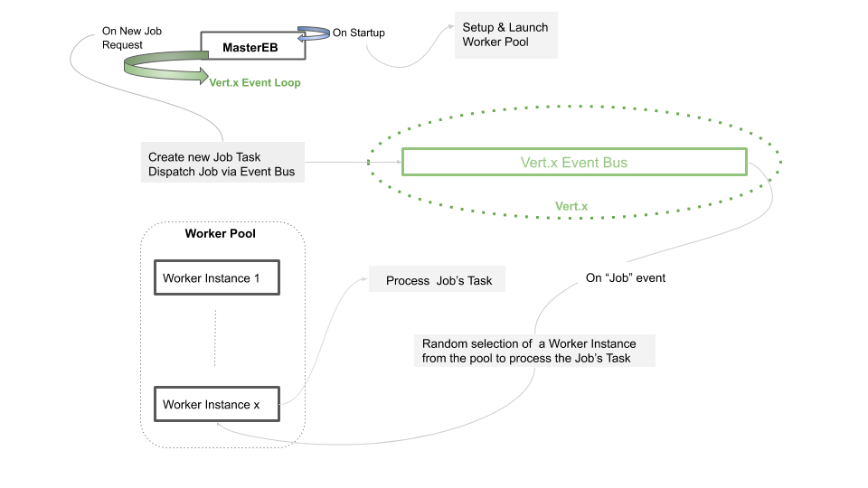

## Problem Statement

Often times we will have tasks that need to be executed (some in parallel and some in 
sequential order -- in our case allocating cloud resources). 
These tasks could take a few seconds or a few minutes and may or may not fail in various ways.

## Solution Approach

A Worker Design Pattern can address several of the challenges encountered when dealing with 
application scalability, resiliency and availability. 
 
From a high level perspective applying this pattern to our problem statement 
can be depicted by this diagram:

 
* The master node(s) are responsible for managing the cluster by making overall decisions. 

* The worker nodes are tasked with executing the workload as directed by the master node.

In addition to balancing the workload, by limiting the number of concurrent tasks being processed
by a worker pool, we can also guard against resource exhaustion or suffer performance
problems due to contention for scarce resources.

## Implementation Stack 

The first iteration of this implementation leverages [Vert.x](http://vertx.io)

Vert.x is a JVM based platform that can be used to build reactive systems. 
It is event-driven and uses message passing for processing work; 
Those messages are by default handled by the event loop which is (usually) a single thread responsible 
to find the right handler for an incoming message, and process it. 

But what if we need to process long-running tasks? Those long tasks will prevent any other task f
rom being performed until they are complete, resulting in severe performance degradations. 
To solve that problem, Vert.x introduces the concept of worker verticles.

A Vert.x application is typically composed of one or several verticles, 
which are similar to modules, executing in their own context on top of 
a Vert.x instance. 

### Iteration 1

The purpose of the first iteration is to provide a simple 
approach for  how to implementation the worker pattern using strictly Vert.x Event Bus
as illustrated by the following diagram:

### Iteration 2

Will add the following:

* Leverage Redis as the actual Job Queue.

* Job concept will include more properties related to: state, priority, type, maxConcurency, etc...

* Job event will be emitted via Vert.x Event Bus for properties changes so that Metrics  
Workers can persist statistics- The same data can be exposed over REST for a clients such 
as UI or for monitoring 

Ad Vertx Clustering:

* Discovery and group membership of nodes 
	
* Cluster wide topic subscriber list

* HA mode for any deployed verticle

* Address Multi steps related sequential Tasks as potentially a Workflow type Job
  by leveraging Redis Transaction

          

###  Prerequisites

* JDK 8+

### Building

1. Clone this repo: 

2. Build the project use the provided gradle wrapper:

    ./gradlew clean build

It should generates wpe-merge-fat.jar in the `build/libs` directory.

### Running 

Start the app using the the following command:

    java -jar ./build/libs/workers.jar 
    
Alternatively you use the provided Dockerfile
    
    docker build -t nboumaza/workers .
    docker run -t -i -p 7070:7070 nboumaza/workers:latest

#### Simulating Job Submissions

To Simulate some random sampling of job submission with the provided simple Ruby client.

    ./demo.rb

### Logging

Logging is directed to ./logs/workers.log  

### Solution Improvement Space

1. Beef up unit testing 
2. Complete Iteration 2.
3. Potentially re-write the solution using (once beefed up more on Go 
   Chan Chan Chan -:)
   

